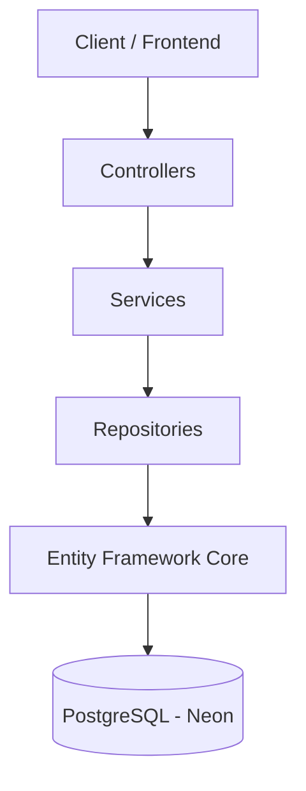

# 📝 NoteesApp API


API RESTful para **gerenciamento de notas**, permitindo organização por **pastas** e **tags**.  
O projeto foi desenvolvido com **.NET 10**, **Entity Framework Core** e **PostgreSQL**, utilizando boas práticas de arquitetura como **Repository Pattern**, **Service Layer Pattern** e **DTOs** para desacoplamento da camada de dados.

Este projeto foi criado como **projeto de portfólio** para demonstrar conhecimentos em desenvolvimento **Backend com .NET**, arquitetura limpa e boas práticas de API.

---

# 🔗 Links do Projeto

| Recurso | Link |
|------|------|
| Backend (GitHub) | https://github.com/PedroBeltraoDev/NoteesApp-BE |
| API em Produção | https://noteesapp-be.onrender.com/api |
| Swagger | https://noteesapp-be.onrender.com/swagger |
| Banco de Dados | Neon PostgreSQL (Cloud) |

---

# 🚀 Tecnologias Utilizadas

| Categoria | Tecnologia |
|---|---|
| Backend | .NET 10 |
| ORM | Entity Framework Core |
| Banco de Dados | PostgreSQL (Neon) |
| Documentação | Swagger / OpenAPI |
| Deploy | Render / Vercel |
| Arquitetura | Repository Pattern + Service Layer |
| Infra | Docker |
| Segurança | CORS + HTTPS |

---

# 🏗️ Arquitetura

A API segue uma arquitetura em camadas para manter **separação de responsabilidades** e facilitar manutenção e testes.
Client
  │
  ▼
Controllers
  │
  ▼
Services (Regras de Negócio)
  │
  ▼
Repositories (Acesso a Dados)
  │
  ▼
Entity Framework Core
  │
  ▼
PostgreSQL (Neon)

---

# 📊 Diagrama de Arquitetura



---

# 📁 Estrutura do Projeto

```text
NotesApp.Api
│
├── Controllers
│   └── NotesController.cs
│
├── Services
│   ├── INoteService.cs
│   └── NoteService.cs
│
├── Repositories
│   ├── INoteRepository.cs
│   └── NoteRepository.cs
│
├── Models
│   └── Note.cs
│
├── DTOs
│   ├── CreateNoteDto.cs
│   ├── UpdateNoteDto.cs
│   ├── NoteResponseDto.cs
│   └── ApiResponseDto.cs
│
```
├── Mappers
│   └── NoteMapper.cs
│
├── Middleware
│   └── ExceptionHandlingMiddleware.cs
│
├── Data
│   └── AppDbContext.cs
│
├── Program.cs
└── appsettings.json
```

---

# 📦 Modelo de Dados

### Note

```json
{
  "id": 1,
  "title": "Minha Nota",
  "content": "Conteúdo da nota...",
  "folder": "Projetos",
  "tags": [".NET", "Backend"],
  "isPinned": false,
  "createdAt": "2026-03-06T00:00:00Z",
  "updatedAt": "2026-03-06T00:00:00Z"
}
```

---

# 📡 Endpoints da API

| Método | Endpoint | Descrição |
|------|------|------|
| GET | `/api/notes` | Listar todas as notas |
| GET | `/api/notes/{id}` | Buscar nota por ID |
| POST | `/api/notes` | Criar nova nota |
| PUT | `/api/notes/{id}` | Atualizar nota |
| DELETE | `/api/notes/{id}` | Remover nota |
| GET | `/api/notes/folders` | Listar pastas distintas |
| GET | `/api/notes/tags` | Listar tags distintas |

---

# 📌 Exemplos de Requisições

## Criar Nota

```bash
curl -X POST https://noteesapp-be.onrender.com/api/notes \
-H "Content-Type: application/json" \
-d '{
  "title": "Aprender .NET",
  "content": "Estudar arquitetura de APIs",
  "folder": "Estudos",
  "tags": ["backend", ".net"],
  "isPinned": false
}'
```

---

## Listar Notas

```bash
curl https://noteesapp-be.onrender.com/api/notes
```
---

## Buscar Nota por ID

```bash
curl https://noteesapp-be.onrender.com/api/notes/1
```

---

## Atualizar Nota

```bash
curl -X PUT https://noteesapp-be.onrender.com/api/notes/1 \
-H "Content-Type: application/json" \
-d '{
"title": "Aprender .NET Avançado",
"content": "Estudar arquitetura limpa",
"folder": "Estudos",
"tags": ["backend",".net"],
"isPinned": true
}'
```

---

## Deletar Nota

```bash
curl -X DELETE https://noteesapp-be.onrender.com/api/notes/1
```

---

# ⚙️ Variáveis de Ambiente

| Variável | Descrição |
|---|---|
| `ConnectionStrings:DefaultConnection` | String de conexão com PostgreSQL |
| `ASPNETCORE_ENVIRONMENT` | Ambiente da aplicação |

Exemplo:

```env
ConnectionStrings__DefaultConnection=postgresql://...
ASPNETCORE_ENVIRONMENT=Production
```

---

# 🐳 Docker

O projeto inclui um **Dockerfile** para facilitar containerização e deploy.

Build da imagem:

```bash
docker build -t noteesapp-api .
```

Executar container:

```bash
docker run -p 8080:8080 noteesapp-api
```
---

# 📜 Scripts Disponíveis

| Comando | Descrição |
|---|---|
| `dotnet restore` | Restaurar dependências |
| `dotnet build` | Compilar projeto |
| `dotnet run` | Executar aplicação |
| `dotnet publish -c Release` | Gerar build de produção |
| `dotnet test` | Executar testes |

---

# 🔐 Segurança

A API implementa diversas práticas de segurança:

- 🔐 **HTTPS obrigatório**
- 🌍 **CORS configurado**
- 🧾 **Validação de inputs com DataAnnotations**
- ⚠️ **Middleware global de exceções**
- 📦 **DTOs para evitar exposição direta das entidades**

---

# 🧠 Decisões de Arquitetura

| Decisão | Motivo |
|---|---|
| Repository Pattern | Separar acesso a dados da lógica de negócio |
| Service Layer | Centralizar regras e validações |
| DTOs | Evitar exposição de entidades |
| Mapper dedicado | Conversão entre camadas |
| Exception Middleware | Respostas de erro padronizadas |

---

# ☁️ Deploy

| Configuração | Valor |
|---|---|
| Plataforma | Render |
| Tipo | Web Service |
| Região | Oregon (US West) |
| Deploy | Automático via GitHub |

---

# 🐛 Problemas Conhecidos

| Problema | Status |
|---|---|
| Sem autenticação de usuários | Planejado |
| Sem paginação nas consultas | Planejado |
| Sem cache de consultas | Planejado |

---

# 🤝 Como Contribuir

1. Faça um **fork** do projeto  
2. Crie uma branch

```bash
git checkout -b feature/minha-feature
```

3. Faça commit das alterações

```bash
git commit -m "feat: minha nova feature"
```

4. Envie para o GitHub

```bash
git push origin feature/minha-feature
```

5. Abra um **Pull Request**

---

# 📄 Licença

Este projeto está licenciado sob a **MIT License**.

---

# 👨‍💻 Autor

**Pedro Beltrão**

GitHub  
https://github.com/PedroBeltraoDev

---

⭐ Se este projeto te ajudou ou foi útil, considere **dar uma estrela no repositório**!
